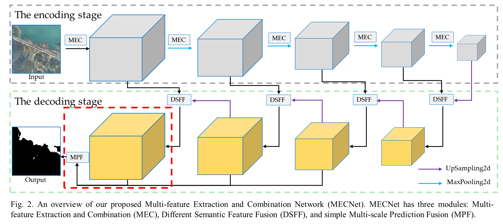
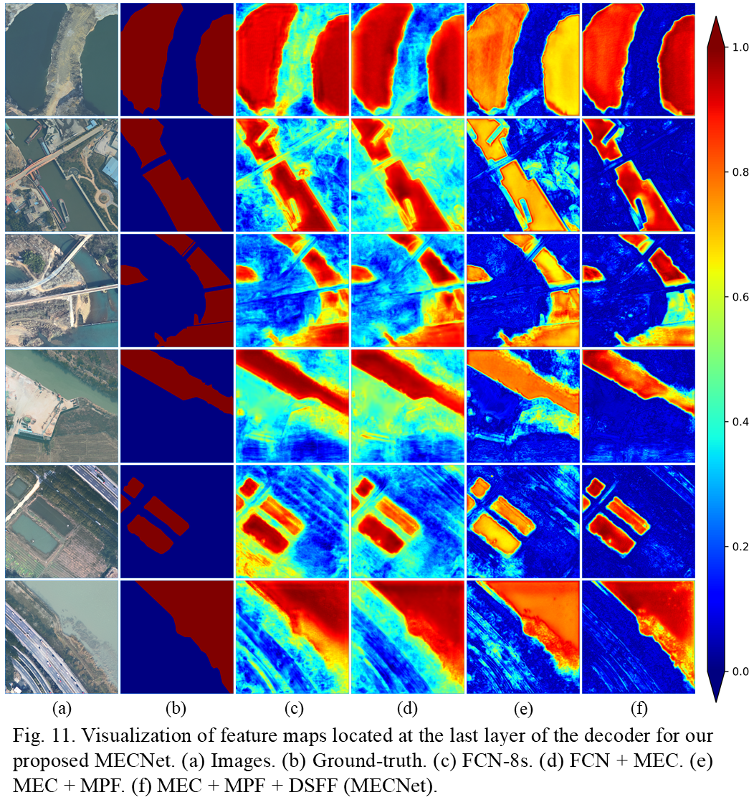

# MECNet  
This repo holds code for [MECNet: Rich CNN features for water-body segmentation from very high resolution aerial and 
satellite imagery]()  
The network is to identify the outline of water-bodies accurately from very high resolution (VHR) remote sensing 
imagery, particularly for complicated and challenging water-body samples.



To understand the contribution of different modules we proposed in the accurate extraction of the water-bodies, 
we visualized the feature maps at the last layer of the decoder. This is because this layer consists of the MEC, 
DSFF, and MPF modules. We sequentially visualized the feature maps of FCN, "FCN + MEC", 
"MEC + MPF" and "MEC + MPF + DSFF", as shown in Figure 11. The feature maps were visualized by taking the maximum 
response value in the channel dimension of the feature maps, which represented the response of each convolutional 
kernel to the water body features at each spatial location. 


## Usage

### 1. Environment

Please prepare an environment with python=3.7, and then use the command "pip install -r requirements.txt" for the dependencies.

### 2. Prepare data

Please prepare data about water-body and specify the corresponding data path.

### 3. Train/Predict

- Run the train script on Water-body dataset. The batch size can be reduced to 4.

```bash
python train.py
```

- Run the predict script on Water-body dataset. 

```bash
python predict.py 
```
## Citations

```bibtex
@article{Alisirs2021MECNet,
  title={MECNet: Rich CNN features for water-body segmentation from very high resolution aerial and 
satellite imagery},
  author={Zhili Zhang, Meng Lu, Shunping Ji, Huafen Yu and Chenhui Nie},
  journal={remotesensing-1173355},
  year={2021}
}
```
